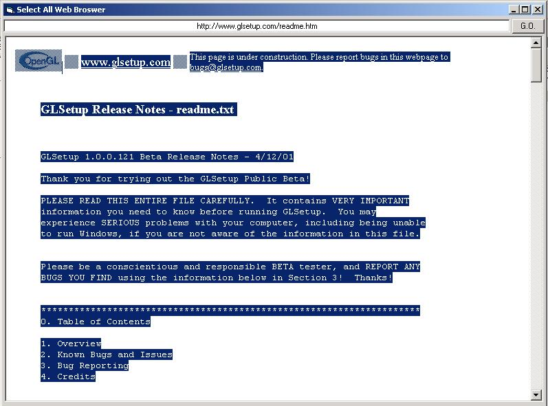



## Emulating the mouse RIGHT click using vb WEB Browser Control

### Description

This code will show you how to use the right mouse click options (SELECT ALL, SHOW SOURCE, COPY, PASTE, SAVE AS, SAVE) when using the visual basic web browser control. i've looked for this everywhere and i could not find it, so i finally came up with this sollution and i would like to share it with you all (Very usefull code a MUST SEE)
 
### More Info
 

             |
---                |---
**Submitted On**   |2002-10-28 17:37:10
**By**             |[Rafael Bonventi](https://github.com/Planet-Source-Code/PSCIndex/blob/master/ByAuthor/rafael-bonventi.md)
**Level**          |Intermediate
**User Rating**    |4.7 (14 globes from 3 users)
**Compatibility**  |VB 6\.0
**Category**       |[Coding Standards](https://github.com/Planet-Source-Code/PSCIndex/blob/master/ByCategory/coding-standards__1-43.md)
**World**          |[Visual Basic](https://github.com/Planet-Source-Code/PSCIndex/blob/master/ByWorld/visual-basic.md)
**Archive File**   |[Web\_Browse14884910282002\.zip](https://github.com/Planet-Source-Code/rafael-bonventi-emulating-the-mouse-right-click-using-vb-web-browser-control__1-40232/archive/master.zip)

